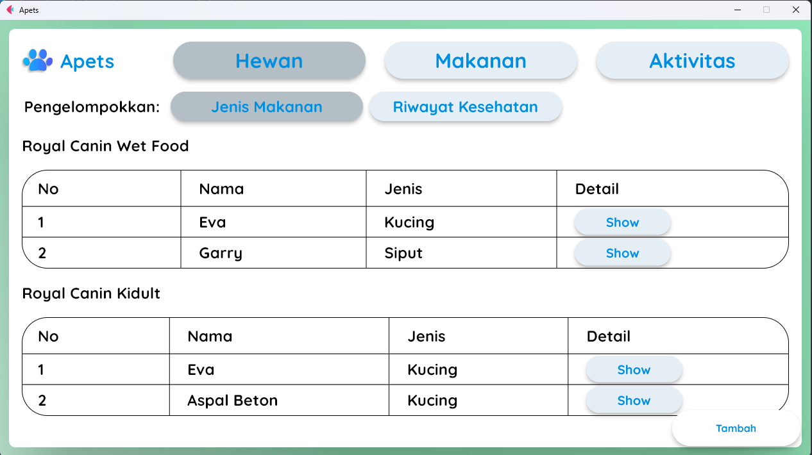

# IF2250-2023-K01-G01-Apets

## Anggota Kelompok

1. Fakhri Muhammad Mahendra - 13521045
2. Kenneth Ezekiel Suprantoni - 13521089
3. Akbar Maulana Ridho - 13521093
4. Arsa Izdihar Islam - 13521101

## Deskripsi Singkat

Kepemilikan hewan peliharaan bukanlah hal yang jarang ditemui. Malah, banyak orang yang memelihara lebih dari satu hewan. Dengan bertambahnya hewan peliharaan, tingkat kesulitan untuk merawat dan mengatur informasi menjadi semakin sulit. Oleh karena itu, Apets dibuat untuk membantu pengguna mengurus hewan peliharaan. P/L ini memungkinkan pengguna untuk mengatur informasi hewan peliharaannya, mulai dari informasi umum hingga detail, seperti makanan hewan, riwayat kesehatan, dan jadwal kegiatan hewan.

## Cara Menjalankan Aplikasi

Prerequisites: Python 3.8 or newer

### Clone repository

`git clone git@gitlab.informatika.org:akbarmr/if2250-2023-k01-g01-apets.git`

### Create virtual environment (optional)

On project folder, create python virtual environment

`python3 -m venv venv`

Activate virtual environment

`source venv/bin/activate`

### Install dependencies

`pip install -r requirements.txt`

### Run program

`python3 src/main.py`

## Implementasi Modul

| Nama Modul                  | Dikerjakan oleh |
|-----------------------------|-----------------|
| Daftar hewan                | 13521101        |
| Daftar kelompok hewan       | 13521101        |
| Penambahan hewan            | 13521089        |
| Detail hewan                | 13521089        |
| Daftar makanan              | 13521045        |
| Penambahan makanan ke hewan | 13521045        |
| Penambahan makanan          | 13521093        |
| Riwayat kesehatan           | 13521093        |

## Tampilan Modul

1. Daftar hewan

2. Daftar Kelompok hewan

Berdasarkan jenis makanan

Berdasarkan riwayat kesehatan

3. Penambahan hewan

4. Detail hewan

5. Daftar makanan

6. Penambahan makanan ke hewan

7. Penambahan Makanan

8. Riwayat kesehatan

## Implementasi Basis Data

Berikut adalah daftar tabel yang diimplementasikan

### Tabel Hewan

| Nama Atribut  | Tipe data | Constraint  |
|---------------|-----------|-------------|
| id_hewan      | integer   | Primary key |
| nama          | varchar   | not null    |
| jenis         | varchar   | not null    |
| tanggal lahir | date      |             |

### Tabel Riwayat Hewan

| Nama Atribut | Tipe data | Constraint                                |
|--------------|-----------|-------------------------------------------|
| id_riwayat   | integer   | Primary key                               |
| id_hewan     | integer   | Foreign key references on Hewan(id_hewan) |
| riwayat      | varchar   | not null                                  |
| waktu_awal   | date      |                                           |
| waktu_akhir  | date      |                                           |

### Tabel Makanan

| Nama Atribut | Tipe data | Constraint  |
|--------------|-----------|-------------|
| id_makanan   | integer   | Primary key |
| nama_makanan | varchar   |             |

### Tabel Jenis Makanan

| Nama Atribut | Tipe data | Constraint                                 |
|--------------|-----------|--------------------------------------------|
| id_makanan   | integer   | Foreign key references Makanan(id_makanan) |
| id_hewan     | integer   | Foreign key references Hewan(id_hewan)     |
|              |           | Primary key (id_makanan, id_hewan)         |